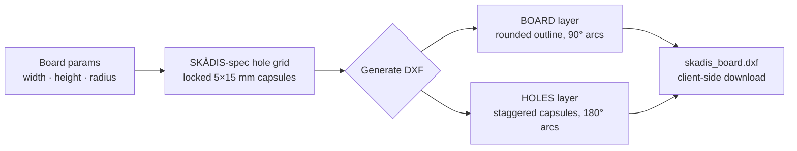

# SKÅDIS DXF Generator

[](https://skadis-dxf.pages.dev/)
[](https://www.typescriptlang.org/)
[](https://react.dev/)
[-646cff?logo=vite&logoColor=white)](https://vite.dev/)

> A browser-based generator for custom-sized, **IKEA SKÅDIS-compatible** pegboard DXF files — tweak the board size, preview the hole grid, and export a ready-to-cut file for laser cutters or CNC routers.

SKÅDIS pegboards are useful, but you're stuck with IKEA's fixed sizes. This tool lets you cut your own SKÅDIS-spec board at any dimension while keeping the hole pattern *exactly* locked to the original, so every official SKÅDIS accessory still drops in. Everything runs client-side: the DXF is generated in your browser and downloaded as a file — no server, no upload, works offline once loaded.

---

## ✨ Features

- **Locked SKÅDIS hole spec** — slot size (5 × 15 mm), corner radius (3 mm), horizontal spacing (20 mm), and vertical spacing (40 mm) are fixed to match genuine IKEA SKÅDIS accessories.
- **Parametric board** — choose any width, height, and corner radius (100–2000 mm), with a rounded-corner outline.
- **Live SVG preview** — see the board and the full hole grid update instantly as you type, with a running hole count.
- **Staggered grid** — columns offset by half a row to reproduce the real SKÅDIS brick pattern, laid out from the top-right corner.
- **Clean two-layer DXF** — a `BOARD` outline layer (green) and a `HOLES` layer (red), in millimeters, ready for CAM software.
- **100% client-side** — DXF generation happens in-browser via [`dxf-writer`](https://github.com/ognjen-petrovic/js-dxf); no backend, no tracking, no file uploads.
- **Responsive UI** — works on desktop and mobile.

---

## 🚀 Usage

### Try it live

Open **[skadis-dxf.pages.dev](https://skadis-dxf.pages.dev/)** — enter your dimensions, check the preview, click **Generate DXF**, then **Download DXF**.

With the defaults (762 × 559 mm, 8 mm radius) the preview reports:

```text
Board: 762 × 559 mm, Holes: 481
```

### Run locally

Prerequisites: **Node.js 20+** (the project uses Vite 7 / `rolldown-vite`) and npm.

```bash
npm install
npm run dev
```

Then open the URL Vite prints (default `http://localhost:5173`).

### ✂️ Cutting note (CNC)

When routing the holes, use an **outside** or **pocket** toolpath — not **on the line**. This tells the machine to offset the path by the bit radius so the finished holes match the intended size. For laser cutting, no offset is needed.

---

## ⚙️ Configuration

Board dimensions are user-editable; the hole pattern is intentionally locked to the SKÅDIS spec. All values are in **millimeters**.

| Parameter | Default | Editable | Description |
|---|---|---|---|
| Board Width | 762 (30″) | ✅ | Overall board width |
| Board Height | 558.8 (22″) | ✅ | Overall board height |
| Corner Radius | 8 | ✅ | Rounded board-corner radius |
| Hole Width | 5 | 🔒 | Slot width (SKÅDIS) |
| Hole Height | 15 | 🔒 | Slot height (SKÅDIS) |
| Hole Corner Radius | 3 | 🔒 | Slot end-cap radius |
| Horizontal Spacing | 20 | 🔒 | Distance between columns |
| Vertical Spacing | 40 | 🔒 | Distance between staggered rows |
| Top Offset | 40 | 🔒 | Margin from the top edge |
| Right Offset | 20 | 🔒 | Margin from the right edge |

The hole grid is generated from the top-right corner: the first column sits at `width − 20`, every odd column shifts down by `40 / 2`, and holes step down by 40 mm until they no longer fit. Want a non-standard hole pattern? Fork it and edit the `DEFAULTS` block in `src/App.tsx`.

---

## 🧱 How it works



The app is a single-page React component (`src/App.tsx`). On **Generate DXF**, it dynamically imports `dxf-writer`, creates a `Drawing` in millimeters, and adds two layers:

- **`BOARD`** (green) — a closed polyline for the board outline with 90° rounded corners drawn as arc segments (`bulge = tan(π/8)`).
- **`HOLES`** (red) — each slot is a vertical capsule (stadium shape): a closed polyline with two 180° semicircular end-caps (`bulge = −1`) joined by straight sides.

The resulting DXF string is wrapped in a `Blob` and offered as a download named `skadis_board.dxf`. The live preview is a separate SVG render of the same dimensions, scaled to fit a 400 px box.

---

## 📦 Scripts

| Command | What it does |
|---|---|
| `npm run dev` | Start the Vite dev server with hot reload |
| `npm run build` | Type-check (`tsc -b`) and build for production into `dist/` |
| `npm run preview` | Preview the production build locally |
| `npm run lint` | Run ESLint |

### Deploy

The demo is hosted on Cloudflare Pages. To deploy your own copy:

```bash
npm run build
npx wrangler pages deploy dist --project-name=skadis-dxf
```

---

## 🤝 Contributing

This is a small, focused tool — PRs that improve DXF correctness, preview fidelity, or accessibility are welcome. Development setup is the standard Vite flow: `npm install`, then `npm run dev`. Please run `npm run lint` and `npm run build` before opening a pull request.

---

## 📄 License

MIT. No `LICENSE` file is currently committed — add one to formalize the redistribution terms.

DXF output is produced by [`dxf-writer`](https://github.com/ognjen-petrovic/js-dxf) by Ognjen Petrović. SKÅDIS is a trademark of Inter IKEA Systems B.V.; this project is independent and not affiliated with or endorsed by IKEA.
